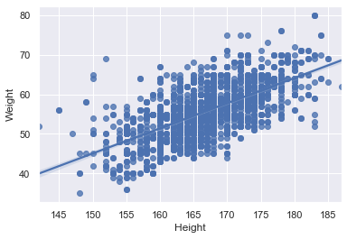

# Optimal BMI for runners

## Intro

In this project we analyse data from elite athletes and give you an estimate of the optimal BMI to enhance your running performance. We looked at the data from actual Olympic athletes so you don't have to, and here's how it looked like:
    

  

But worry not, we've got you. Let's unpack this and make it useful for you.

## Findings

What we realised during our investigation is...

## Why should you care?

## How can you use this information?

## Tell us about you

Now, let's see how we can make all of this useful to you. Let's start by getting to know you better.

